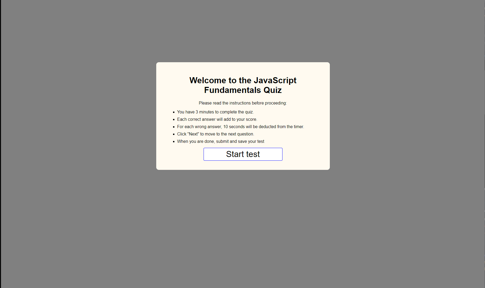
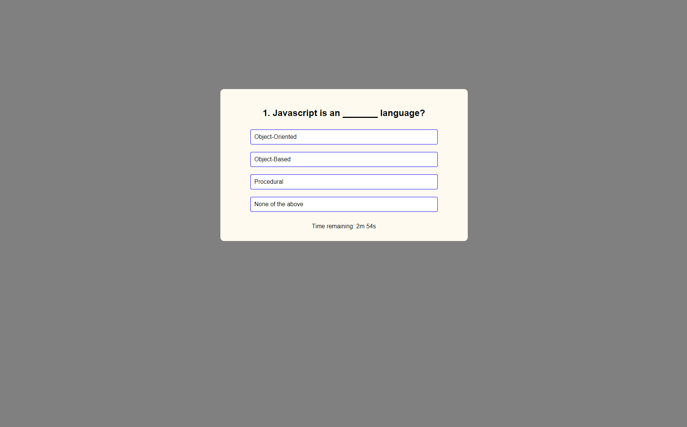

# Challenge 04: Quiz

# This program will quiz you on the fundanmentals of Java Script.

* The program will start off at a welcome screen. It will provide you with the instructions on how
to take the quiz as following:

            *You have 3 minutes to complete the quiz.
            *Each correct answer will be one point.
            *For each wrong answer, 10 seconds will be deducted from the timer.
            *Click "Next" to move to the next question.
            *When you are done, enter your name save your test.

* After you are done reading the instruction go ahead and click the "START TEST" button and your test will start.

* The is a mutiple choice quiz. Pick the best answer for each question. You only have one chance when your answer is selected. It will be mark as "green" for correct and "red" as wrong. A button will than appear call "NEXT", click on it to go to the next question. 

* When you finish or when the time runs out, you will be navaigated to the results page where you will see how you did. Each question you answer correctly is score as 1 point. The time that it took for you to complete the test will also be shown as a result. Any questions you answer wrong and had time taken off will reflect in the time. 

* You will need to enter your name and save your test score. After saving you can close out the test.

# Screen shot of application

# Link to deplpoyed application

https://freeway9527.github.io/XengXiong_Challenge4_JS_Quiz/

# References 

Coding Ninjas. (2023, September 26). Coding Ninjas Studio. Retrieved September 27, 2023, from https://www.codingninjas.com/studio/library/how-to-create-a-javascript-quiz-code

GeeksforGeeks. (2023). Create a quiz application using JavaScript. GeeksforGeeks. Retrieved September 27, 2023, https://www.geeksforgeeks.org/how-to-create-a-simple-javascript-quiz/

How to make a simple JavaScript quiz  |  Simple Steps Code. (2023). Simple Steps Code. Retrieved September 27, 2023, from https://simplestepscode.com/javascript-quiz-tutorial/

Jaiswal, S. (2021). JavaScript MCQ (Multi Choice Questions) - javatpoint. Retrieved September 27, 2023, https://www.javatpoint.com/javascript-mcq 

Kings Gambit Labs. (2023, August 17). 50 JavaScript MCQ with answers. InterviewBit. Retrieved September 27, 2023, from https://www.interviewbit.com/javascript-mcq/#upon-encountering-empty-statements-what-does-the-javascript-interpreter-do

